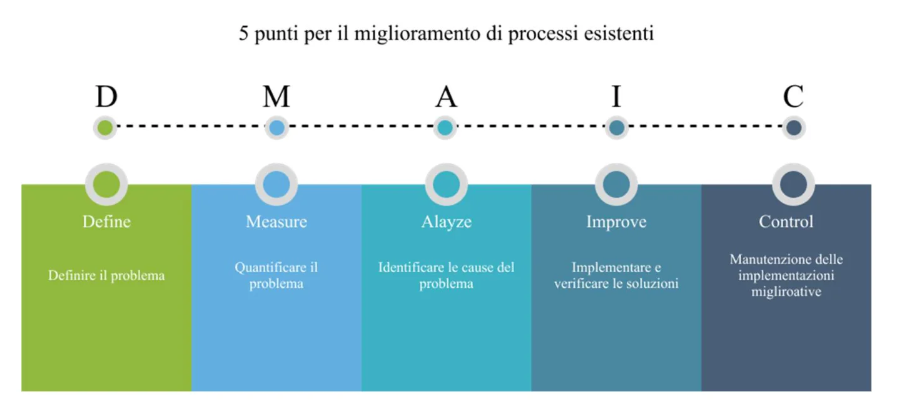
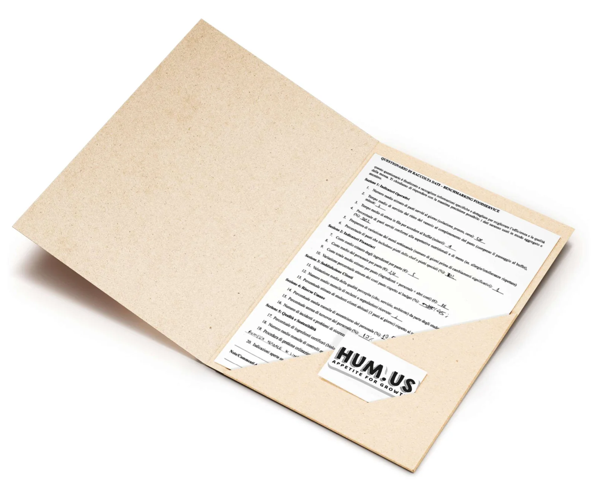
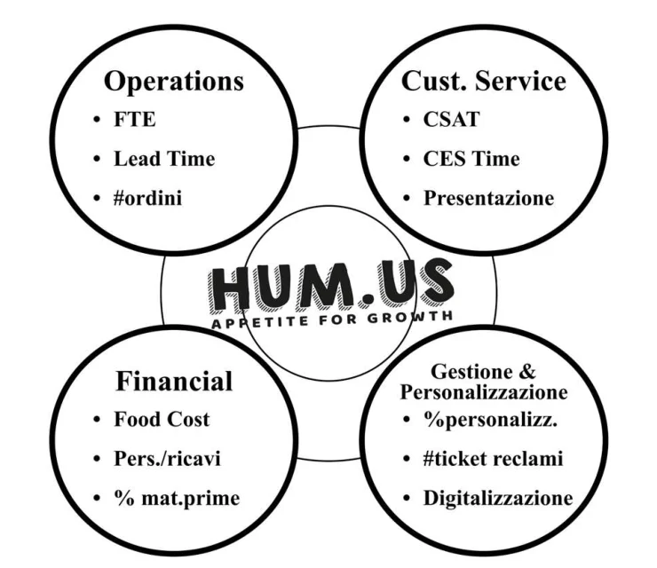
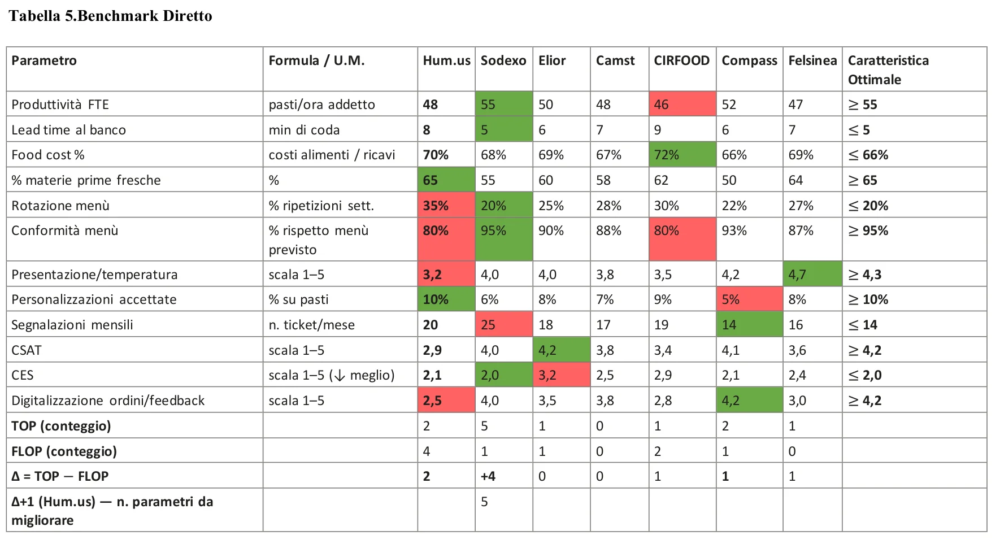
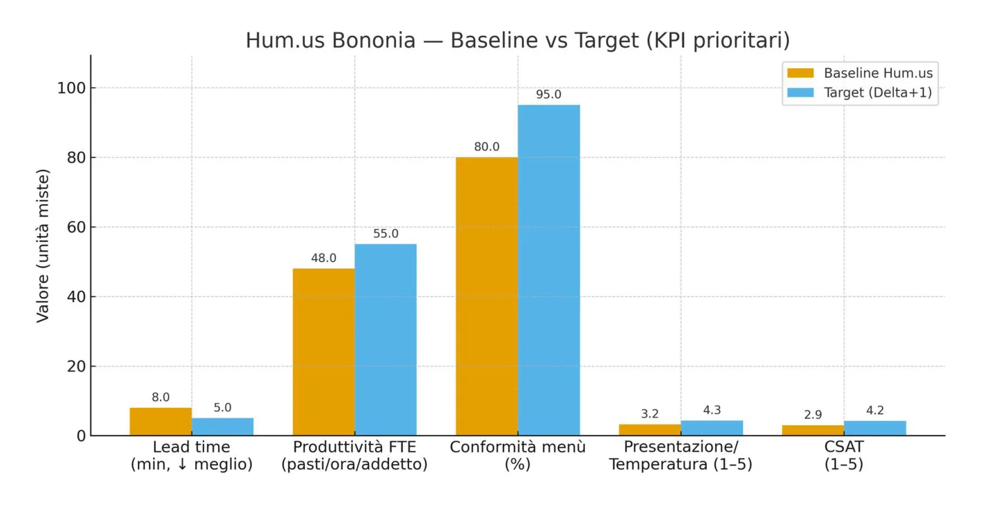
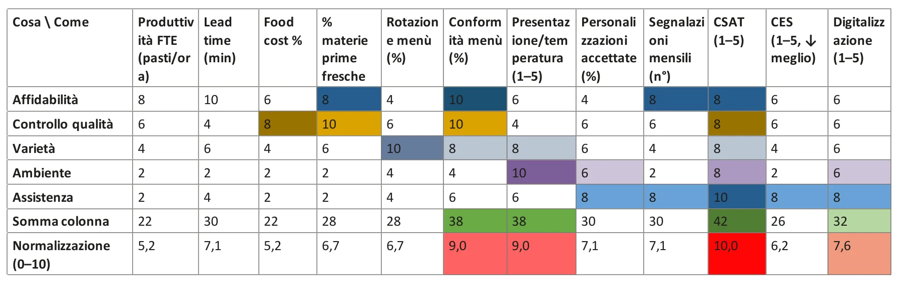
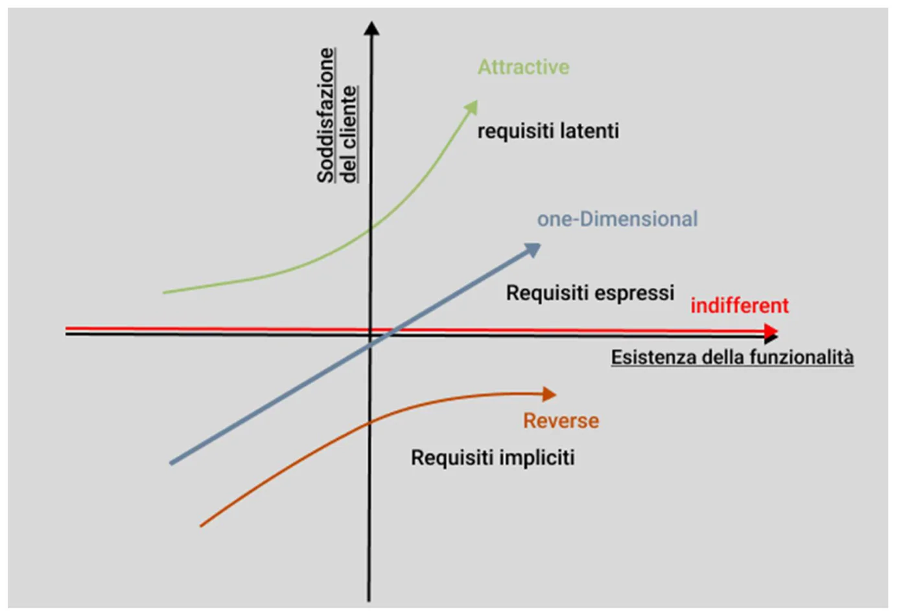
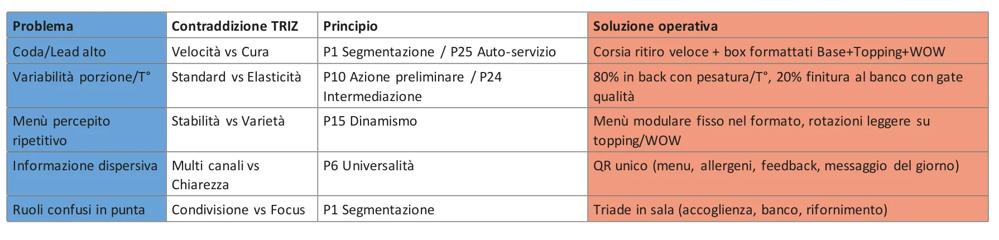

<!-- BOZZE da far correggere ad Adriano: le frasi-sezione sono proposte,
     i fatti vengono dalla tesi (verificati). Dek ufficiale dal menù portfolio. -->

## Ogni intuizione parte da un numero.

Hum.us Space Bononia è un servizio reale di ristorazione collettiva,
analizzato e riprogettato con il ciclo **DMAIC** — la spina dorsale
ingegneristica del Six Sigma — combinato con gli strumenti del service design.
È anche il mio progetto di tesi.

## Ho misurato il servizio dall'interno.

Osservazione diretta (Gemba Walk), questionari agli stakeholder e
documentazione gestionale, strutturati in un pannello di KPI: operations,
customer service, finanza, personalizzazione.

## Il confronto coi big della ristorazione collettiva.

Il benchmark diretto contro i principali operatori italiani ha individuato i
gap prioritari: produttività, tempi di coda, conformità del menù,
soddisfazione del cliente.

## Dai gap alle priorità di progetto.

La matrice **QFD** Cosa/Come e il modello di **Kano** traducono i gap in
driver di progetto: affidabilità e conformità come requisiti di base,
velocità e produttività come prestazionali, digitalizzazione e
personalizzazione come attrattivi.

## Le contraddizioni diventano soluzioni.

Con il **TRIZ** ogni contraddizione operativa diventa una soluzione concreta:
corsia di ritiro veloce con meal box modulari, menù modulare nel formato,
un solo QR per menù, allergeni e feedback, ruoli chiari in sala.

## Il metodo diventa campagna.

La campagna visiva — meal box, piatti, poster, voucher, segnaletica — porta
la stessa identità: *Appetite for Growth*.
