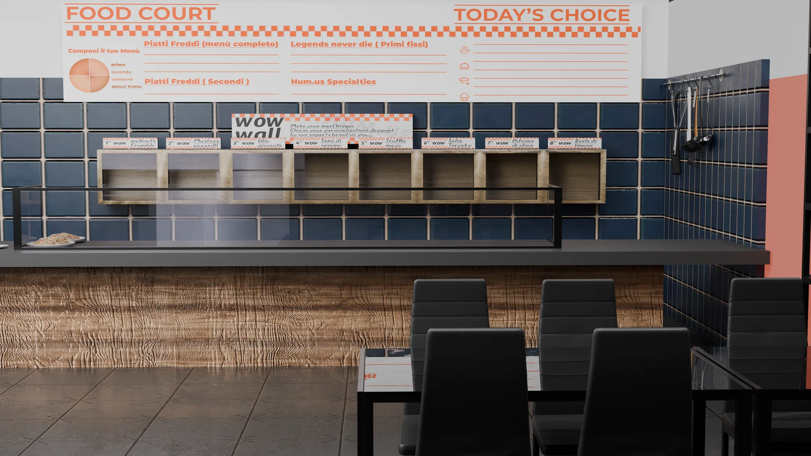
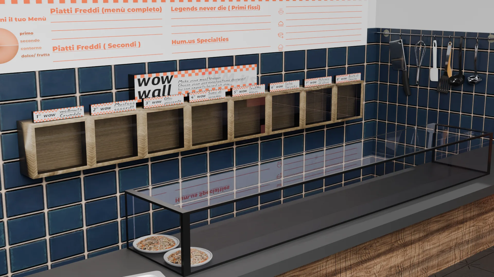
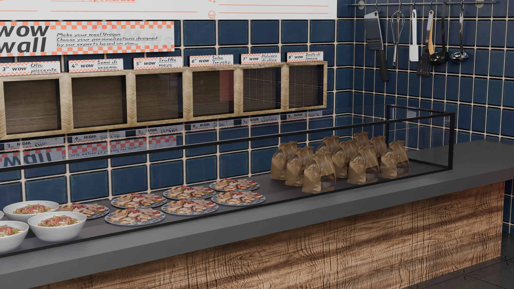
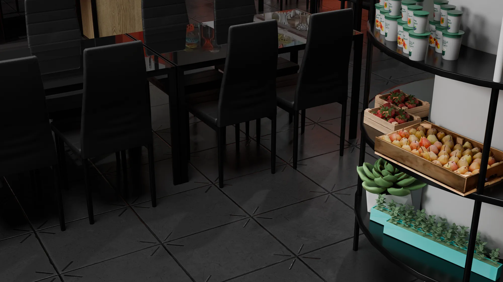
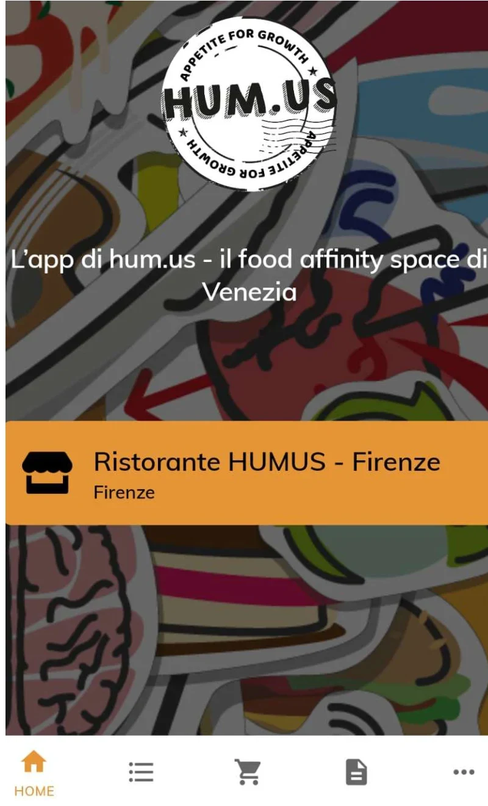
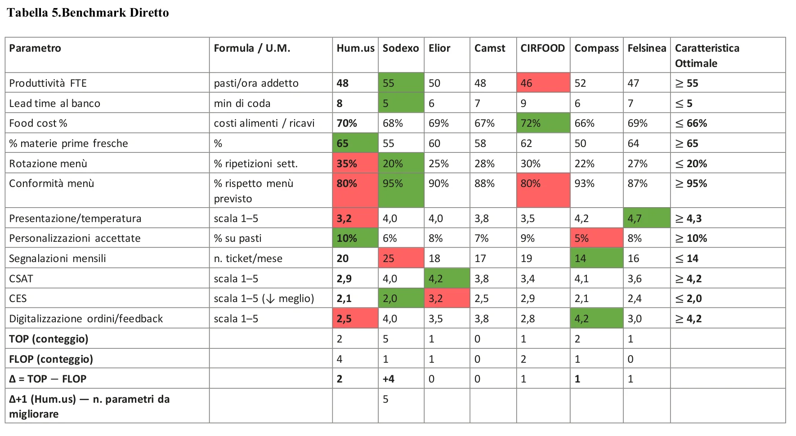
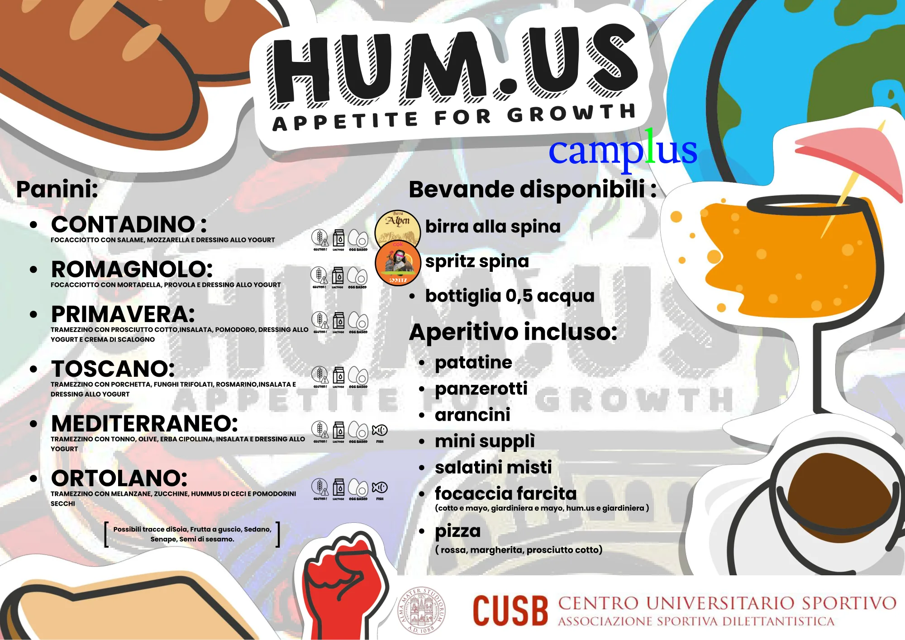
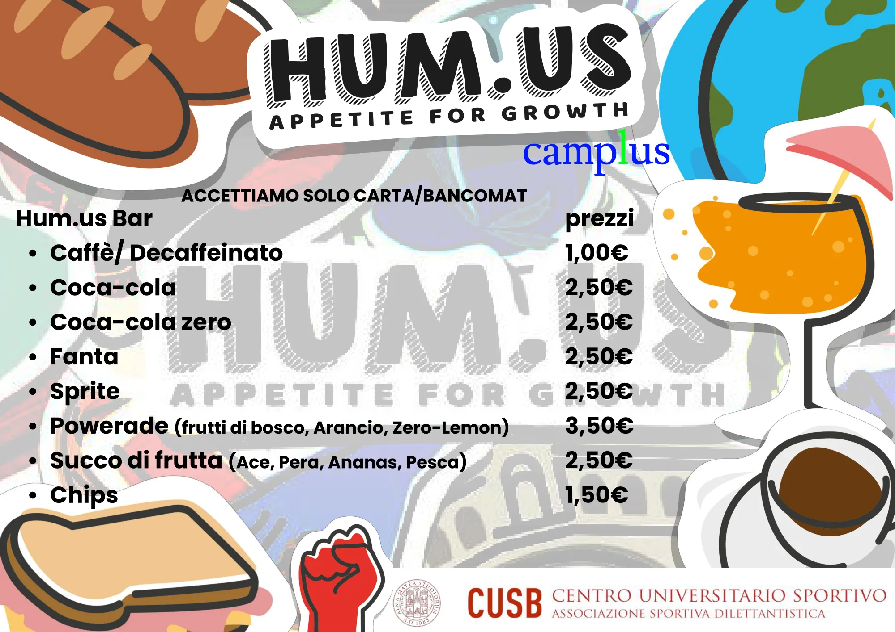

<!-- BOZZA da far correggere ad Adriano. I 5 principi e i fatti vengono dalla
     tesi (verificati); i render sono quelli caricati in cartella. -->

Hum.us Space è un servizio di ristorazione collettiva reale. Il progetto lo
ripensa senza cambiarne la scala: **stesso grande numero di persone**, ma un
livello di servizio e una controllabilità di costi e proposte completamente
diversi. Il nuovo concept si regge su **cinque principi**.

## 01 — Servizio 80/20

**80% preparato in cucina, 20% finito al banco davanti al cliente.** Il gesto
finale — il "WOW" — alza il livello percepito del piatto senza rallentare la
linea. La cucina lavora su formati prevedibili, il cliente vede terminare il
suo piatto.

## 02 — Menù a compartimenti · Base + Topping + WOW

Il menù ha lo **stesso formato ogni giorno** e varia per piccoli scarti
guidati (proteina, topping, tocco finale). Sono **compartimenti stagni**: si
decide cosa proporre in base allo stock di magazzino, tenendo la qualità
sempre sullo stesso livello.

## 03 — Corsia di ritiro veloce

Una linea separata per i **ready-meal box**, pronti su un tavolo dedicato:
ritiro in 10–15 secondi. Taglia la coda del buffet e alleggerisce la
pressione sulla cucina, rendendo prevedibili gli ordini che la raggiungono.

## 04 — Self-service autonomo

Frutta, snack e complementi in un'**area self-service dedicata**: il cliente
si serve da solo, il personale resta concentrato sul servizio che conta.

## 05 — QR universale

Un solo **QR — su cartello e sui box** — per menù, allergeni, feedback e
ordini. Un unico touchpoint digitale che sostituisce la stampa giornaliera
dei menu cartacei.

## Come ci sono arrivato

I cinque principi non sono intuizioni. Nascono da un percorso **Six Sigma**
(ciclo DMAIC) e da un **benchmark diretto** contro i grandi operatori della
ristorazione collettiva: i dati hanno detto dove intervenire.

Da lì, **QFD** e **Kano** hanno tradotto i gap in priorità, e il **TRIZ** ha
sciolto le contraddizioni chiave — velocità vs qualità, varietà vs food cost,
personalizzazione vs produttività — nelle cinque soluzioni operative diventate
i principi del concept.

## Il valore di un designer interno

Tutta la comunicazione — cartelli, poster, voucher, segnaletica — nasce dalla
**stessa mano e nello stesso momento** del servizio. Non è un appalto a uno
studio esterno che cambia team e tempi ad ogni lavoro: è un designer interno
che vive il progetto ogni giorno, si prende la **responsabilità** delle scelte
e le giustifica con ricerca e calcoli. Contenuti prodotti su richiesta rapida,
con una coerenza e una visione che restano coese nel tempo.

